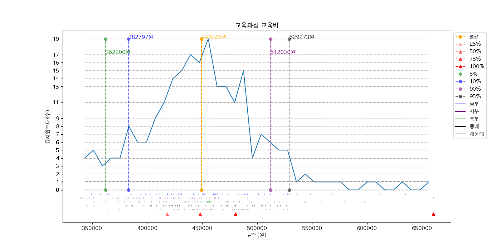
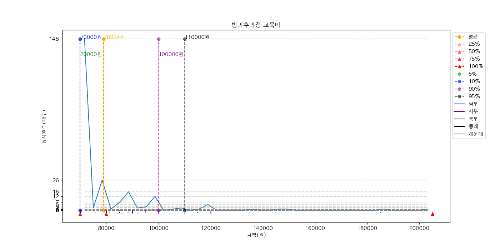
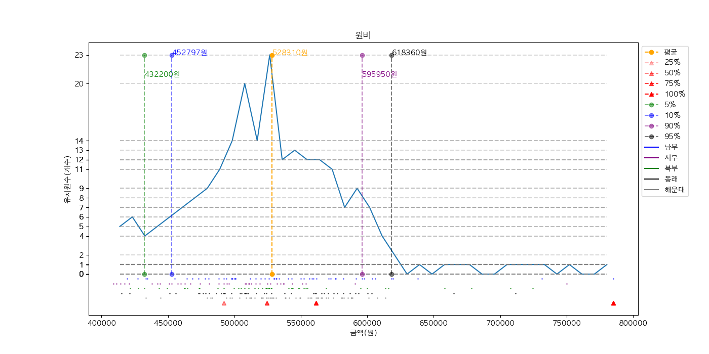

[병합풀기(붙임) 2023학년도 사립유치원 확정원비 취합(최종)-2023-03-28기준 (2).xlsx](병합풀기(붙임)%202023학년도%20사립유치원%20확정원비%20취합(최종)-2023-03-28기준%20(2).xlsx)가 엄마가 보내준 raw data인데 여기서 필요한 데이터만 정리해서 데이터를 뽑은 csv 파일이 [확정원비(2023)-표 1.csv](확정원비(2023)-표%201.csv)이다. 이 csv 파일은 각 유치원별 교육과정 교육비 - 입학졸업경비, 교육과정 교육비, 방과후과정 교육비, 원비를 나타낸다.

위의 csv 파일을 기반으로 [2023년 원비 데이터 분석.py](2023년%20원비%20데이터%20분석.py)를 이용해 그래프를 나타낸 것이 아래 3개의 png 파일이다. x축은 금액(원)을, y축은 유치원수(개수)를 나타낸 것이다. 금액을 slice(40) 조각으로 나눈 후 각 구간의 유치원수를 나타내었으며 금액의 5%, 10%, 90%, 95%를 세로 점선으로, 25%, 50%, 75%, 100%를 빨간색 역삼각형으로 나타내었다. y축의 값은 각 구간의 유치원수만을 표시하였고, 개수를 쉽게 파악하기 위해 y축에 나타난 값을 지나고 x축과 평행한 점선을 모두 나타내었다. 평균을 지나는 세로 점선도 그렸다. 금액의 5%, 10%, 90%, 95%, 평균의 각 세로 점선의 상단에 해당 금액을 표시하였다.

아래 3개의 그래프는 교육과정 교육비, 방과후과정 교육비, 원비를 그래프로 나타낸 것이다. 교육과정 교육비는 입학졸업경비도 포함된 것이다.

교육과정 교육비

방과후과정 교육비

원비

